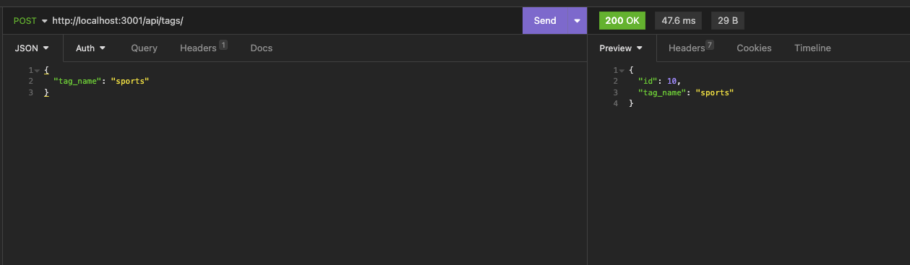

# eCommerce Back-End

## Description

This application demonstrates a functional back end to an ecommerce site that allowed me practice with Sequelize and MySQL (and continued practice with Express) to manipulate a relational database with primary/foreign key relationships. Though not hooked up to a front end yet, it can be tested with an application like Insomnia, that allows testing of multiple routes. It was a great way to see a practical purpose for new skills being developed.

## Installation

You'll need a recent version of Node installed and the space to install the packages needed for this, included in the package.json. Otherwise, as mentioned above, you'll need an application like [Insomnia](https://insomnia.rest/) to test your endpoints. Finally, you'll need MySql enabled on your device, with login information.

## Usage

To use, first log in to your MySql shell and run the schema.sql file. Next, you'll need to make sure localhost:3001 is an available port. Once confirmed, run the command node server in your command line to be able to begin testing with Insomnia, or your API development platform of choice.

Here's a screenshot of Insomnia in action:

